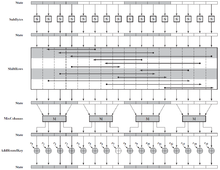

# 2019-2-OSS-L6
# The Algorithms - Java - ciphers - AES

## AES란?
고급 암호화 표준(Advanced Encryption Standard, AES)은 2001년 미국 표준 기술 연구소(NIST)에 의해 제정된 암호화 방식이다. AES는 두 명의 벨기에 암호학자인 존 대먼과 빈센트 라이먼에 의해 개발된 Rijndael(레인달)에 기반하며 AES 공모전에서 선정되었다.

AES는 미국 정부가 채택한 이후 전 세계적으로 널리 사용되고 있다. 1977년 공표된 DES를 대체한 AES는, 암호화와 복호화 과정에서 동일한 키를 사용하는 대칭 키 알고리즘이다.

미국 표준 기술 연구소(NIST)는 2001년 11월 26일 AES를 미국 연방 정보 처리 표준(FIPS-197)으로 공포하였다. NIST는 5년의 표준화 과정을 거쳤으며 이 과정에서 15개의 알고리즘이 경쟁, Rijndael 암호가 가장 적합한 알고리즘으로 선정되었다. 이 표준은 2002년 5월 26일부터 효력을 발휘하기 시작했다. AES는 ISO/IEC 18033-3 표준에 포함되어 있으며 여러 암호화 패키지에서 사용되고 있다. AES는 또한 미 국가안보국에 의해 1급비밀(Top Secret)에 사용할 수 있도록 승인된 알고리즘 중 최초로 공개되어 있는 알고리즘이다.

Rijndael은 알고리즘의 개발자인 빈슨트 레이믄(Vincent Rijmen)과 요안 대믄(Joan Daemen)의 이름을 따서 지은 것으로 AES 표준은 여러 Rijndael 알고리즘 중 블록 크기가 128비트인 알고리즘을 말한다.

## AES 암호화 알고리즘 개요와 암호화 과정
1. 이 구조에서 주목할 만한 특징 중 하나는 이 구조가 페이스텔 구조가 아니라는 것이다. 전형적인 페이스텔 구조를 떠올려 보면 데이터 블록 반쪽을 다른 반쪽을 수정하는 데 사용했고 그 두 반쪽을 교환하였다. AES는 페이스텔 구조를 사용하지 않고 각 라운드에서 대체(substitution)와 치환(permutation)을 이용해서 데이터 블록 전체를 병렬 처리한다.

2. 입력으로 사용하는 키를 44개의 32비트 워드 배열 w[i]로 확장한다. 4개의 서로 다른 워드(128비트)를 각 라운드에서 라운드 키로 사용한다.

3. 다음 네 가지 단계를 이용하는데, 한 번의 치환과 세 번의 대체이다.
 - 바이트 대체(Substitute bytes): S-box[6]라는 표를 이용하여 바이트 단위(byte-to-byte) 형태로 블록을 교환한다.
 - 행 이동(Shift rows) : 단순히 행과 행을 치환한다.
 - 열 섞기(Mix columns) : 열에 속한 모든 바이트를 순환 행렬을 사용해 함수로 열에 있는 각 바이트를 대체하여 변화시킨다.
 - 라운드 키 더하기(Add round key) : 확장된 키의 일부와 현재 블록을 비트별로 XOR한다.

4. 암호와 복호를 위해서 라운드 키 더하기 단계에서 시작하고, 각 라운드에서는 4단계를 모두 포함하는 9라운드를 수행하고, 3단계로 구성된 10번째 라운드를 수행한다.

5. 오직 라운드 키 더하기 단계에서만 키를 사용한다. 그래서 암호와 복호 과정의 시작과 끝은 항상 라운드 키 더하기 단계이다. 시작이나 끝에 수행되는 다른 단계는 키 없이 역방향 계산이 가능하기 때문에 보안을 강화시키는 데는 아무 역할도 하지 못한다.

6. 라운드 키 더하기 단계는 그 자체가 강력하지 못대는 대신 다른 세 단계와 같이 작동하여 비트를 뒤섞는 역할을 한다. 하지만 각각은 키를 사용하지 않으므로 보안성을 제공하는 것은 아니다. 이 암호 단계를 살펴보면 블록에 XOR 암호화(라운드 키 더하기)를 하고, 그 다음 블록을 뒤섞고(다른 세 단계), 그 뒤에 다시 XOR 암호화를 하는 것으로 이를 번갈아서 적용하는 것을 볼 수 있다. 이 구조는 효과적이고 보안성을 매우 강화시킨다.

7. 각 단계를 역으로 계산하기는 쉽다. 바이트 대체, 행이동, 열 섞기 단계는 복호 알고리즘에서 사용되는 역함수이다, 라운드 키 더하기 단계에서는 같은 라운드 키를 블록에 XOR 수행하여 역을 계산한다.

8. 대부분 블록 암호가 그렇듯 복호 알고리즘에서는 확장 키를 순서를 뒤집어서 적용한다. 그러나 복호 알고리즘이 암호 알고리즘과 동일하지는 않다. 이것이 AES구조가 가지고 있는 특성이다.

9. 4단계가 모두 역 계산이 가능하므로 복호화를 하면 평문을 얻을 수 있다는 것은 당연하다.

10. 암호와 복호의 마지막 라운드는 오직 세 단계로만 구성된다. 이것이 AES구조가 가진 특성이고, 이 특성은 AES암호가 역으로 작동되기 위해 필요한 것이다.  

AES 암호화 라운드  

## 파트 담당자
- 표세승(컴퓨터공학/16) : **PYO-SE-SEUNG**  
