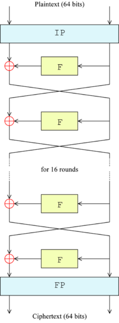
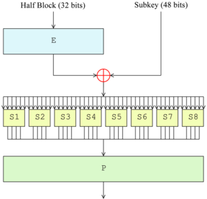

# 2019-2-OSS-L6
# The Algorithms - Java - ciphers - DES

## DES란?
데이터 암호화 표준(Data Encryption Standard, DES)은 블록 암호의 일종으로, 미국 NBS (National Bureau of Standards, 현재 NIST)에서 국가 표준으로 정한 암호이다. DES는 대칭키 암호이며, 56비트의 키를 사용한다.

DES는 현재 취약한 것으로 알려져 있다. 56비트의 키 길이는 현재 컴퓨터 환경에 비해 너무 짧다는 것이 하나의 원인이며, DES에 백도어가 포함되어 있어 특수한 방법을 사용하면 정부 기관에서 쉽게 해독할 수 있을 것이라는 주장도 제기되었다. 1998년에 전자 프론티어 재단(EFF)에서는 56시간 안에 암호를 해독하는 무차별 대입 공격 하드웨어를 만들었으며, 1999년에는 22시간 15분 안에 해독하는 하드웨어를 만들었다.

DES를 세 번 반복해서 사용하는 Triple-DES는 DES에 비해 안전한 것으로 알려져 있으며, 또한 현재는 DES 대신 AES(Advanced Encryption Standard)가 새 표준으로 정해져 사용되고 있다.

## DES 암호화 알고리즘 개요와 암호화 과정
페이스텔 구조는 라운드로 구성되어있고, DES 암호화 과정에서 크게 3가지로 나눌 수 있다.

- 초기 치환 & 최종 치환

- 16번의 라운드 함수 연산

- 라운드 키 생성  

DES 암호화 과정  

암호화에 대한 구체적인 알고리즘 과정 내용은 이 [페이지](https://developer-mac.tistory.com/52)를 방문하여 참고하는 것을 추천한다.

## 파트 담당자
- 표세승(컴퓨터공학/16) : **PYO-SE-SEUNG**  
