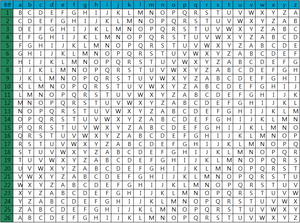
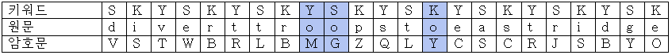

# 2019-2-OSS-L6
# The Algorithms - Java - ciphers - Vigenere

## Vigenere(비즈네르) 암호란?
비즈네르 암호(프랑스어: Vigenère)는 프랑스 외교관이었던 블레즈 드 비즈네르에 의하여 1586년에 발표된 암호이다.
외교관이었던 비즈네르는 26세 되던 해 로마로 발령받아 2년간 근무 하던 중 알베르티의 글을 읽고 암호학에 관심을 기울이게 된다. 39세에 그는 평생 연구에 매달릴수 있을만큼 돈을 모았다고 판단하고 외교관을 그만 둔다. 알베르티의 논문을 자세히 분석하여, 이를 통해 '비즈네르 사이퍼'라 부르는 것을 만들게 된다.

비즈네르 암호의 장점은 '빈도분석법'으로 해독이 거의 불가능하다는 사실이다. 또한, 열쇠의 개수가 무궁무진하다는 것도 큰 장점이다. 비즈네르 암호는 '복합 알파벳'에 속한다. 이러한 장점으로 인해 '난공불락의 사이퍼'라는 별명이 붙게 되었다.

## Vigenere(비즈네르) 암호 암호화 개요 및 과정
먼저 암호문 제작을 위해서 아래의 표와 같은 이른바 '비즈네르 표'를 만들어야 한다.

이 '비즈네르 표'는 원문 알파벳 아래에 26가지 사이퍼 알파벳이 나열되어있다. 사이퍼 알파벳은 한 줄 내려갈 때마다 한 자씩 뒤로 이동하게 되며,1번 줄은 1칸 이동한 카이사르 암호 알파벳과 동일하다.

이런 식으로 2번 줄은 2칸 이동,3번 줄은 3칸 이동 카이사르 사이퍼 알파벳과 같다.

비즈네르 표   
 

그러므로 예를 들어 암호화 키로 4번째 사이퍼 알파벳을 사용할 경우,
a->E로 대체되고,
g->K로 대체된다.

암호문 작성시 한가지 사이퍼 알파벳만 사용하게 되면 보완성이 낮은 카이사르 알파벳과 동일하여 빈도분석법으로 충분히 해독이 가능하게 된다.
이를 보완하기 위해 키워드(열쇠)를 이용한다. 키워드(열쇠)는 수신자와 송신자가 아무 단어나 선택할 수 있다.

예를 들어 비즈네르 암호의 키를 sky라 하였을 때,
'divert troops to east ridge'는 'VSTWBR LBMGZQ LY CSCR JSBYO'로 암호화된다.

비즈네르 암호화 결과   
 

## 파트 담당자
- 표세승(컴퓨터공학/16) : **PYO-SE-SEUNG**  
